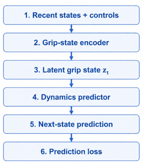

# Differentiable Grip-State Learning for Vehicle Dynamics Prediction
A differentiable vehicle dynamics model that learns a hidden grip state from motion history to improve prediction under changing road conditions.

## Why this project?

The same steering, throttle, or braking input can produce very different vehicle motion depending on tire-road grip:
- On a dry road, the car may follow the expected path.
- On a slippery road, the same input can lead to a wider turn, sliding, or unstable motion.

The problem is that grip is often not directly measured or available as a label.
So the question is: **Can a vehicle dynamics model learn useful information about grip directly from how the vehicle moves?**

## Main idea

1. Instead of giving the model a fixed friction coefficient, we let it learn an internal **latent grip state** from recent vehicle motion and control inputs.
2. The model then uses this hidden grip representation to predict the next vehicle state.
3. No direct friction labels are required.

## How it works

1. The model receives recent vehicle states and control inputs.
2. A grip-state encoder looks at how the vehicle reacted to those inputs.
3. The encoder produces a latent grip representation.
4. The dynamics predictor uses the current state, control input, and latent grip state to predict the next vehicle state.
5. Prediction error is used to train the full model end-to-end.

   

## Behavior-gated grip update

Grip information is not equally useful at every moment.
- During normal driving, small changes in motion may simply be noise.
- During braking, cornering, or unstable motion, vehicle behavior gives much more information about available grip.

The gated version therefore updates the latent grip state more strongly during these high-dynamics situations.

## Models compared

The original experiment compared three versions:
- Baseline: predicts vehicle dynamics without a separate grip state
- Always-grip: uses a latent grip state that is continuously updated
- Gated-grip: updates the latent grip state mainly when vehicle behavior provides useful grip information

The gated version gave the lowest prediction error in the original synthetic experiment, especially in high-dynamics cases.

## Current status

1. The original project was evaluated on synthetic data with hidden friction changes as a proof of concept.
2. The results suggest that learning a latent grip representation can improve vehicle dynamics prediction when grip changes, especially during demanding vehicle motion.
3. Real-world validation is still needed.
